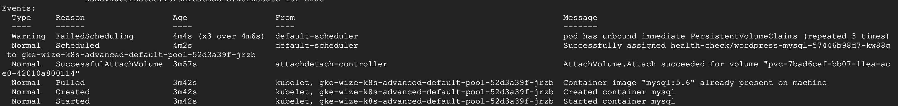
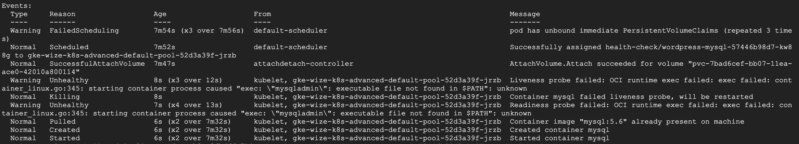
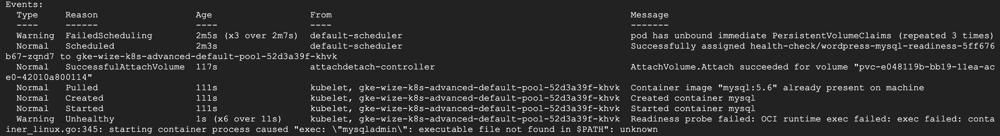
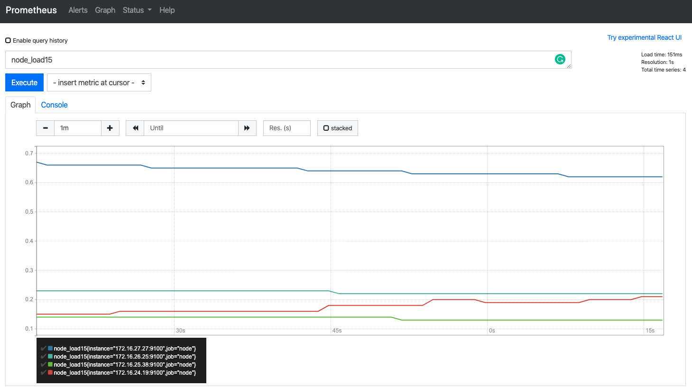

# Table of contents

* **[Preparation](#preparation)**
* **[Application](#application)**
* **[Persisting Data](#persisting-data)**
* **[Secrets](#secrets)**
* **[Healthchecks](#healthchecks)**
* **[Resource Management](#resource-management)**
* **[Daemonset](#daemonset)**
* **[CronJob](#cronjob)**
* **[Ingress](#ingress)**

# Preparation

1. Visit the GCP Console using an **incognito window** by going to
https://console.cloud.google.com/kubernetes/list?folder=&organizationId=&project=wizeline-academy-k8s-36bd66a7
2. Log in using the *Google Account* that you provided on the Wizeline
Academy registration form.
3. Click on the *Connect* button that appears besides the
`gke-academy-1` cluster.
4. Next hit the *Run in Cloud Shell* button to get the command that
connects to the K8s Cluster.
5. Hit enter on the `gcloud` command to execute it.
6. Send the *Cloud Shell* to a new window by hitting the button with
the little arrow.
7. Open the *Cloud Shell Editor* by clicking on the little pencil icon,
we'll use the editor to create the YAML files.

# First steps

# Namespaces

## IMPORTANT: Create your own namespace.

The format suggested to use for the namespace name is
`firstName-lastName`, i.e juan-perez.

```bash
# Create your own namespace
kubectl create namespace <firstName-lastName>

# IMPORTANT: Set the namespace in the current context
kubectl config set-context --current --namespace=<firstName-lastName>
```

## Namespaces explained

```bash
# List the namespaces
kubectl get namespaces
```

The students will see all the namespaces from the other participants.
The resources each participant create will be created
inside their own namespace, collisions will not happen
no matter if their resources are named the same.

One common example about how namespaces are used in real
world scenarios is to separate application environments, like
`development` and `production`.

# Wordpress application

For this example we have a basic application in Wordpress with its database over MySQL.
We're going to use official MySQL and Wordpress docker images from DockerHub.

So, first we need to deploy MySQL database over our K8s with the next **svc** and **deployment** configuration.

## MySQL deployment

This is a basic deployment and service k8s configuration

wordpress-mysql.yaml
```yaml
# This is the service
apiVersion: v1
kind: Service
metadata:
  name: wordpress-mysql
  labels:
    app: wordpress
spec:
  ports:
    - port: 3306
  selector:
    app: wordpress
    tier: mysql
  clusterIP: None
---
# This is the deployment
apiVersion: apps/v1 # for versions before 1.9.0 use apps/v1beta2
kind: Deployment
metadata:
  name: wordpress-mysql
  labels:
    app: wordpress
spec:
  selector:
    matchLabels:
      app: wordpress
      tier: mysql
  strategy:
    type: Recreate
  template:
    metadata:
      labels:
        app: wordpress
        tier: mysql
    spec:
      containers:
      - image: mysql:5.6
        name: mysql
        env:
        - name: MYSQL_ROOT_PASSWORD
          value: root
        ports:
        - containerPort: 3306
          name: mysql
```

```bash
# Create the MySQL database we will use for Wordpress
kubectl apply -f wordpress-mysql.yaml
```

## Wordpress application deployment
Then, we're going to deploy wordpress application.
You would notice that for wordpress deployment we're going to use a **LoadBalancer** service kind instead of ClusterIP service.
And we're going to use the name of database service such database host name.

wordpress.yaml
```yaml
apiVersion: v1
kind: Service
metadata:
  name: wordpress
  labels:
    app: wordpress
spec:
  ports:
    - port: 80
  selector:
    app: wordpress
    tier: frontend
  type: LoadBalancer
---
apiVersion: apps/v1 # for versions before 1.9.0 use apps/v1beta2
kind: Deployment
metadata:
  name: wordpress
  labels:
    app: wordpress
spec:
  selector:
    matchLabels:
      app: wordpress
      tier: frontend
  strategy:
    type: Recreate
  template:
    metadata:
      labels:
        app: wordpress
        tier: frontend
    spec:
      containers:
      - image: wordpress:4.8-apache
        name: wordpress
        env:
        - name: WORDPRESS_DB_HOST
          value: wordpress-mysql
        - name: WORDPRESS_DB_PASSWORD
          value: root
        ports:
        - containerPort: 80
          name: wordpress
```
```bash
# Create the Wordpress application
kubectl apply -f wordpress.yaml
```

### Test wordpress

In order to test we have to:
* Set the initial configuration for wordpress
* Then we can create a new entry in the blog for example
* Destroy database and wordpress pods

```bash
# Delete both pods at the same time
kubectl delete pods wordpress-mysql-<id> wordpress-<id>
```

What happend if we visit wordpress URL again?. Content in database was flush and entry doesn't exist now

# Persisting data

For store data across pods we're going to use a **persistentVolume** and it will be use with a **persistentVolumeClaim** in our wordpress pod

wordpress-mysql-pd.yaml
```yaml
apiVersion: v1
kind: Service
metadata:
  name: wordpress-mysql
  labels:
    app: wordpress
spec:
  ports:
    - port: 3306
  selector:
    app: wordpress
    tier: mysql
  clusterIP: None
---
apiVersion: v1
kind: PersistentVolumeClaim
metadata:
  name: mysql-pv-claim
  labels:
    app: wordpress
spec:
  accessModes:
    - ReadWriteOnce
  resources:
    requests:
      storage: 20Gi
---
apiVersion: apps/v1 # for versions before 1.9.0 use apps/v1beta2
kind: Deployment
metadata:
  name: wordpress-mysql
  labels:
    app: wordpress
spec:
  selector:
    matchLabels:
      app: wordpress
      tier: mysql
  strategy:
    type: Recreate
  template:
    metadata:
      labels:
        app: wordpress
        tier: mysql
    spec:
      containers:
      - image: mysql:5.6
        name: mysql
        env:
        - name: MYSQL_ROOT_PASSWORD
          value: root
        ports:
        - containerPort: 3306
          name: mysql
        volumeMounts:
        - name: mysql-persistent-storage
          mountPath: /var/lib/mysql
      volumes:
      - name: mysql-persistent-storage
        persistentVolumeClaim:
          claimName: mysql-pv-claim
```

```bash
# Create the new definition file
kubectl apply -f wordpress-mysql-pd.yaml
```

# Secrets

We are going to add the secret to our file:
```yaml
valueFrom:
  secretKeyRef:
    name: password-secret
    key: mysql-root-password
```

To generate secrets manually we run:
```bash
# Create user mysql secret to health check files
kubectl create secret generic user-secret --from-literal=mysql-user='root'

# Create password mysql secret to health check files
kubectl create secret generic password-secret --from-literal=mysql-root-password='root'

# Delete user mysql secrets
kubectl delete secret user-secret

# Delete password mysql secrets
kubectl delete secret password-secret
```

We can create a folder called secrets where we are going to store our config files.

wordpress-mysql-secrets.yaml
```yaml
apiVersion: v1
kind: Service
metadata:
  name: wordpress-mysql
  labels:
    app: wordpress
spec:
  ports:
    - port: 3306
  selector:
    app: wordpress
    tier: mysql
  clusterIP: None
---
apiVersion: v1
kind: PersistentVolumeClaim
metadata:
  name: mysql-pv-claim
  labels:
    app: wordpress
spec:
  accessModes:
    - ReadWriteOnce
  resources:
    requests:
      storage: 20Gi
---
apiVersion: apps/v1 # for versions before 1.9.0 use apps/v1beta2
kind: Deployment
metadata:
  name: wordpress-mysql
  labels:
    app: wordpress
spec:
  selector:
    matchLabels:
      app: wordpress
      tier: mysql
  strategy:
    type: Recreate
  template:
    metadata:
      labels:
        app: wordpress
        tier: mysql
    spec:
      containers:
      - image: mysql:5.6
        name: mysql
        env:
        - name: MYSQL_USER
          valueFrom:
            secretKeyRef:
              name: user-secret
              key: mysql-user
        - name: MYSQL_ROOT_PASSWORD
          valueFrom:
            secretKeyRef:
              name: password-secret
              key: mysql-root-password
        ports:
        - containerPort: 3306
          name: mysql
        volumeMounts:
        - name: mysql-persistent-storage
          mountPath: /var/lib/mysql
      volumes:
      - name: mysql-persistent-storage
        persistentVolumeClaim:
          claimName: mysql-pv-claim
```

```bash
# Update the MySQL deployment to contain secrets
kubectl apply -f wordpress-mysql-secrets.yaml
```

wordpress-secrets.yaml
```yaml
apiVersion: v1
kind: Service
metadata:
  name: wordpress
  labels:
    app: wordpress
spec:
  ports:
    - port: 80
  selector:
    app: wordpress
    tier: frontend
  type: LoadBalancer
---
apiVersion: apps/v1 # for versions before 1.9.0 use apps/v1beta2
kind: Deployment
metadata:
  name: wordpress
  labels:
    app: wordpress
spec:
  selector:
    matchLabels:
      app: wordpress
      tier: frontend
  strategy:
    type: Recreate
  template:
    metadata:
      labels:
        app: wordpress
        tier: frontend
    spec:
      containers:
      - image: wordpress:4.8-apache
        name: wordpress
        env:
        - name: MYSQL_USER
          valueFrom:
            secretKeyRef:
              name: user-secret
              key: mysql-user
        - name: WORDPRESS_DB_HOST
          value: wordpress-mysql
        - name: WORDPRESS_DB_PASSWORD
          valueFrom:
            secretKeyRef:
              name: password-secret
              key: mysql-root-password
        ports:
        - containerPort: 80
          name: wordpress
```

```bash
# Update the Wordpress deployment to contain secrets
kubectl apply -f wordpress-secrets.yaml
```

# Health Checks
* The kubelet uses liveness probes to know when to restart a container.
* The kubelet uses readiness probes to know when a container is ready to start accepting traffic.

## Liveness

Many applications running for long periods of time eventually transition to broken states, and cannot recover except by being restarted. Kubernetes provides liveness probes to detect and remedy such situations.

```yaml
livenessProbe:
  exec:
    command: ["mysqladmin", "ping"]
  initialDelaySeconds: 15
  periodSeconds: 2
  timeoutSeconds: 1
```

The complete code with the liveness probe is the following.

wordpress-mysql-liveness.yaml
```yaml
apiVersion: v1
kind: Service
metadata:
  name: wordpress-mysql
  labels:
    app: wordpress
spec:
  ports:
    - port: 3306
  selector:
    app: wordpress
    tier: mysql
  clusterIP: None
---
apiVersion: v1
kind: PersistentVolumeClaim
metadata:
  name: mysql-pv-claim
  labels:
    app: wordpress
spec:
  accessModes:
    - ReadWriteOnce
  resources:
    requests:
      storage: 20Gi
---
apiVersion: apps/v1 # for versions before 1.9.0 use apps/v1beta2
kind: Deployment
metadata:
  name: wordpress-mysql
  labels:
    app: wordpress
spec:
  selector:
    matchLabels:
      app: wordpress
      tier: mysql
  strategy:
    type: Recreate
  template:
    metadata:
      labels:
        app: wordpress
        tier: mysql
    spec:
      containers:
      - image: mysql:5.6
        name: mysql
        env:
        - name: MYSQL_USER
          valueFrom:
            secretKeyRef:
              name: user-secret
              key: mysql-user
        - name: MYSQL_ROOT_PASSWORD
          valueFrom:
            secretKeyRef:
              name: password-secret
              key: mysql-root-password
        ports:
        - containerPort: 3306
          name: mysql
        volumeMounts:
        - name: mysql-persistent-storage
          mountPath: /var/lib/mysql
        livenessProbe:
          exec:
            command: ["mysqladmin", "ping"]
          initialDelaySeconds: 15
          periodSeconds: 2
          timeoutSeconds: 1
      volumes:
      - name: mysql-persistent-storage
        persistentVolumeClaim:
          claimName: mysql-pv-claim
```

```bash
# Apply liveness yaml file
kubectl apply -f wordpress-mysql-liveness.yaml

# Get pod name
kubectl get pods

# Validate liveness health-check
kubectl describe pod wordpress-mysql-<id>
```

### Events output

No problem with the pod.


```bash
# Break the liveness probe
kubectl exec wordpress-mysql-<id> -c mysql -- mv /usr/bin/mysqladmin /usr/bin/mysqladmin.off
```

### Events output

Liveness probe failed and the mysql container is restarted.


```bash
# Verify restarts in pod
kubectl get pods
```

## Readiness

Sometimes, applications are temporarily unable to serve traffic. Kubernetes provides readiness probes to detect and mitigate these situations. A pod with containers reporting that they are not ready does not receive traffic through Kubernetes Services.

```yaml
readinessProbe:
  exec:
    command:
      - bash
      - "-c"
      - |
        mysqladmin status -u$MYSQL_USER -p$MYSQL_ROOT_PASSWORD
  initialDelaySeconds: 15
  periodSeconds: 2
  timeoutSeconds: 1
```

The complete code with the readiness probe is the following.

wordpress-mysql-readiness.yaml
```yaml
apiVersion: v1
kind: Service
metadata:
  name: wordpress-mysql
  labels:
    app: wordpress
spec:
  ports:
    - port: 3306
  selector:
    app: wordpress
    tier: mysql
  clusterIP: None
---
apiVersion: v1
kind: PersistentVolumeClaim
metadata:
  name: mysql-pv-claim
  labels:
    app: wordpress
spec:
  accessModes:
    - ReadWriteOnce
  resources:
    requests:
      storage: 20Gi
---
apiVersion: apps/v1 # for versions before 1.9.0 use apps/v1beta2
kind: Deployment
metadata:
  name: wordpress-mysql
  labels:
    app: wordpress
spec:
  selector:
    matchLabels:
      app: wordpress
      tier: mysql
  strategy:
    type: Recreate
  template:
    metadata:
      labels:
        app: wordpress
        tier: mysql
    spec:
      containers:
      - image: mysql:5.6
        name: mysql
        env:
        - name: MYSQL_USER
          valueFrom:
            secretKeyRef:
              name: user-secret
              key: mysql-user
        - name: MYSQL_ROOT_PASSWORD
          valueFrom:
            secretKeyRef:
              name: password-secret
              key: mysql-root-password
        ports:
        - containerPort: 3306
          name: mysql
        volumeMounts:
        - name: mysql-persistent-storage
          mountPath: /var/lib/mysql
        readinessProbe:
          exec:
            command:
              - bash
              - "-c"
              - |
                mysqladmin status -u$MYSQL_USER -p$MYSQL_ROOT_PASSWORD
          initialDelaySeconds: 15
          periodSeconds: 2
          timeoutSeconds: 1
      volumes:
      - name: mysql-persistent-storage
        persistentVolumeClaim:
          claimName: mysql-pv-claim
```

```bash
# Apply readiness yaml file
kubectl apply -f wordpress-mysql-readiness.yaml

# Get pod name
kubectl get pods

# Validate liveness health-check
kubectl describe pod wordpress-mysql-<id>
```

### Events output

No problem with the pod.


```bash
# Break the readiness probe
kubectl exec wordpress-mysql-<id> -c mysql -- mv /usr/bin/mysqladmin /usr/bin/mysqladmin.off
```

### Events output

Readiness probe failed.



```bash
# Verify pod READY flag
kubectl get pods
```

Verify in the browser that exists a problem with the database because is not ready.

```bash
# Fix the readiness probe
kubectl exec wordpress-mysql-<id> -c mysql -- mv /usr/bin/mysqladmin.off /usr/bin/mysqladmin
```

```bash
# Verify pod READY flag
kubectl get pods
```

Verify in the browser that all is working now.

# Resource Management
Now, we're going to define CPU and Memory requests and limits for our MySQL and Wordpress pods.

You will be adding the following `resources` section on each deployment. This section will add `requests` and `limits` resource management values.

```
resources:
  requests:
    memory: "64Mi"
    cpu: "250m"
  limits:
    memory: "128Mi"
    cpu: "500m"
```

**wordpress-rm.yaml**

```yaml
apiVersion: v1
kind: Service
metadata:
  name: wordpress
  labels:
    app: wordpress
spec:
  ports:
    - port: 80
  selector:
    app: wordpress
    tier: frontend
  type: LoadBalancer
---
apiVersion: apps/v1 # for versions before 1.9.0 use apps/v1beta2
kind: Deployment
metadata:
  name: wordpress
  labels:
    app: wordpress
spec:
  selector:
    matchLabels:
      app: wordpress
      tier: frontend
  strategy:
    type: Recreate
  template:
    metadata:
      labels:
        app: wordpress
        tier: frontend
    spec:
      containers:
      - image: wordpress:4.8-apache
        name: wordpress
        env:
        - name: MYSQL_USER
          valueFrom:
            secretKeyRef:
              name: user-secret
              key: mysql-user
        - name: WORDPRESS_DB_HOST
          value: wordpress-mysql
        - name: WORDPRESS_DB_PASSWORD
          valueFrom:
            secretKeyRef:
              name: password-secret
              key: mysql-root-password
        resources:
          requests:
            memory: "64Mi"
            cpu: "250m"
          limits:
            memory: "128Mi"
            cpu: "500m"
        ports:
        - containerPort: 80
          name: wordpress
```

```bash
# Apply the new yaml to the existing deployment
kubectl apply -f wordpress-rm.yaml
```

- Finally, verify that `requests` and `limits` have been applied.
```
# Using jq output manipulation
kubectl get pods -o json --selector=app=wordpress| jq '.items[].spec.containers[].resources'

# Without jq
kubectl get pods  --selector=app=wordpress  -o=custom-columns='Container:spec.containers[*].name,Requests:spec.containers[*].resources.requests,Limits:spec.containers[*].resources.limits'
```
**Output with [jq](https://stedolan.github.io/jq/)**
```
{
  "limits": {
    "cpu": "500m",
    "memory": "128Mi"
  },
  "requests": {
    "cpu": "250m",
    "memory": "64Mi"
  }
}
```

**Output without jq**
```
Container   Requests                    Limits
wordpress   map[cpu:250m memory:64Mi]   map[cpu:500m memory:128Mi]
```

# Daemonset

daemonset.yaml
```yaml
# node-exporter.yaml
apiVersion: apps/v1
kind: DaemonSet
metadata:
  name: node-exporter
  labels:
    app: node-exporter
spec:
  selector:
    matchLabels:
      app: node-exporter
  template:
    metadata:
      labels:
        app: node-exporter
        name: node-exporter
      annotations:
         prometheus.io/scrape: "true"
         prometheus.io/port: "9100"
    spec:
      containers:
        - ports:
            - containerPort: 9100
              protocol: TCP
          resources:
            requests:
              cpu: 0.15
          securityContext:
            privileged: true
          image: prom/node-exporter:v1.0.1
          args:
            - --path.procfs
            - /host/proc
            - --path.sysfs
            - /host/sys
            - --collector.filesystem.ignored-mount-points
            - '"^/(sys|proc|dev|host|etc)($|/)"'
          name: node-exporter
          volumeMounts:
            - name: dev
              mountPath: /host/dev
            - name: proc
              mountPath: /host/proc
            - name: sys
              mountPath: /host/sys
            - name: rootfs
              mountPath: /rootfs
      volumes:
        - name: proc
          hostPath:
            path: /proc
        - name: dev
          hostPath:
            path: /dev
        - name: sys
          hostPath:
            path: /sys
        - name: rootfs
          hostPath:
            path: /
---
kind: Service
apiVersion: v1
metadata:
  annotations:
    prometheus.io/scrape: 'true'
  labels:
    name: node-exporter
  name: node-exporter
spec:
  clusterIP: None
  ports:
  - name: scrape
    port: 9100
    targetPort: 9100
    protocol: TCP
  selector:
    app: node-exporter
```
```bash
# Creating Deamonset
kubectl apply -f daemonset.yaml
```
#### The prometheus server requires a config file to know what are the resources that is going to monitor

prometheus.yml

```yaml
global:
  scrape_interval:     15s
# A scrape configuration containing exactly one endpoint to scrape:
# Here it's Prometheus itself.
scrape_configs:

  - job_name: 'node'
    # Override the global default and scrape targets from this job every 5 seconds.
    scrape_interval: 5s
    dns_sd_configs:
      - names:
        - node-exporter.<firstname-lastName>.svc.cluster.local   # Put your first and last name here
        type: A
        port: 9100
```

## The way we pass this config file to the prometheus pod is through a configMap
```bash
# Creating Configmap from file
kubectl create configmap prometheus-configmap --from-file=prometheus.yml
```

## Then we create a deployment for the prometheus server which will collect and display the metrics of each node and the service that will expose the server

prometheus-deployment.yaml
```yaml
apiVersion: apps/v1
kind: Deployment
metadata:
  name: prometheus-deployment
  labels:
    app: prometheus
    purpose: example
spec:
  replicas: 1
  selector:
    matchLabels:
      app: prometheus
      purpose: example
  template:
    metadata:
      labels:
        app: prometheus
        purpose: example
    spec:
      containers:
      - name: prometheus-example
        image: prom/prometheus
        volumeMounts:
          - name: config-volume
            mountPath: /etc/prometheus/prometheus.yml
            subPath: prometheus.yml
        ports:
        - containerPort: 9090
      volumes:
        - name: config-volume
          configMap:
           name: prometheus-configmap # Here we use the configmap previously defined and it will be mount inside the container
---
kind: Service
apiVersion: v1
metadata:
  name: prometheus-example-service
spec:
  selector:
    app: prometheus
    purpose: example
  ports:
  - name: promui
    protocol: TCP
    port: 9090
  type: NodePort
```

```bash
# Creating deployment
kubectl apply -f prometheus-deployment.yaml
```

## Now we must get the address and port where our server is listening

```bash
export NODE_IP=$(kubectl get nodes -o jsonpath="{.items[0].status.addresses[1].address}")
export NODE_PORT=$(kubectl get  -o jsonpath="{.spec.ports[0].nodePort}" services prometheus-example-service)
# this command will print the address we must put in our browser
echo http://$NODE_IP:$NODE_PORT
```
## if you enter to that url you should see somethin like this if you run the query node_load15
### this shows how there is a pod on each node monitoring its performance


We can clean pods for prometheus with

```yaml
kubectl delete -f daemonset.yaml
kubectl delete -f prometheus-deployment.yaml
```

# CronJob

* Create the folder jobs
* Create a service account with storage-admin permission and generate key (to get the JSON file). Rename the file to service-account.json. (It can also be used a secret link to share the service account like https://onetimesecret.com/ or https://pastebin.pl)

* Go to the tab "Storage", create a new bucket called "academy-advanced-<first-name>-<last-name>"

* Create a Dockerfile with this content:
```
FROM google/cloud-sdk
COPY service-account.json service-account.json
RUN apt-get update && apt-get install -y mysql-client && rm -rf /var/lib/apt
```

* Build image:
```
docker build . -t gcr.io/wizeline-academy-k8s-36bd66a7/<preferred-image-name>
```

* Push image:
```
docker push gcr.io/wizeline-academy-k8s-36bd66a7/<preffered-image-name>
```

* Create the cronjob yaml and replace the values


NOTE: This cronjob is activated every 10 mins.

mysql-cronjob.yaml
```yaml
apiVersion: batch/v1beta1
kind: CronJob
metadata:
  name: mysql-backup
spec:
  schedule: "*/10 * * * *"
  jobTemplate:
    spec:
      template:
        spec:
          restartPolicy: OnFailure
          containers:
            - name: mysql-backup
              image: gcr.io/wizeline-academy-k8s-36bd66a7/<prefered-image-name>
              env:
                - name: GOOGLE_PROJECT
                  value: wizeline-academy-k8s
                - name: DB_HOST
                  value: wordpress-mysql
                - name: DB_USER
                  value: root
                - name: DB_NAME
                  value: mysql
                - name: DB_PASS
                  valueFrom:
                    secretKeyRef:
                      name: password-secret
                      key: mysql-root-password
                - name: GCS_BUCKET
                  value: <my-bucket>
                - name: GCS_SA
                  value: service-account.json
              args:
                - /bin/bash
                - -c
                - mysqldump --user="${DB_USER}" --password="${DB_PASS}" --host="${DB_HOST}" "$@" "${DB_NAME}" > "${DB_NAME}-$(date '+%d|%m|%Y-%H:%M:%S')".sql; gcloud config set project ${GOOGLE_PROJECT}; gcloud auth activate-service-account --key-file "${GCS_SA}"; gsutil cp *.sql gs://"${GCS_BUCKET}"
```

```bash
# Create cronjob
kubectl apply -f mysql-cronjob.yaml
```

* Verify what cronjobs we have scheduled
```bash
kubectl get cronjobs
```

* See the pods and wait for a job to be completed
```bash
kubectl get pods
```

* Inspect the GCS bucket to see the backup files

* Delete the cronjob, so it does not keep adding more files to the bucket
```bash
kubectl delete -f mysql-cronjob.yaml
```

# Ingress

The students will create an ingress to access two different applications through the same load balancer. This resource can help us saving money on load balancers and SSL certificates, as well as reducing management overhead.

```bash
# See if any ingress object exists
kubectl get ingress
```

Google Cloud Shell Editor can be used to easily create these files.

This files will create the necessary resources for our vote & result apps.

voting-app.yaml
```yaml
apiVersion: apps/v1
kind: Deployment
metadata:
  labels:
    app: db
  name: db
spec:
  replicas: 1
  selector:
    matchLabels:
      app: db
  template:
    metadata:
      labels:
        app: db
    spec:
      containers:
      - image: postgres:9.4
        name: postgres
        env:
        - name: POSTGRES_USER
          value: postgres
        - name: POSTGRES_PASSWORD
          value: postgres
        ports:
        - containerPort: 5432
          name: postgres
        volumeMounts:
        - mountPath: /var/lib/postgresql/data
          name: db-data
      volumes:
      - name: db-data
        emptyDir: {}
---
apiVersion: v1
kind: Service
metadata:
  labels:
    app: db
  name: db
spec:
  type: ClusterIP
  ports:
  - name: "db-service"
    port: 5432
    targetPort: 5432
  selector:
    app: db
---
apiVersion: apps/v1
kind: Deployment
metadata:
  labels:
    app: redis
  name: redis
spec:
  replicas: 1
  selector:
    matchLabels:
      app: redis
  template:
    metadata:
      labels:
        app: redis
    spec:
      containers:
      - image: redis:alpine
        name: redis
        ports:
        - containerPort: 6379
          name: redis
        volumeMounts:
        - mountPath: /data
          name: redis-data
      volumes:
      - name: redis-data
        emptyDir: {}
---
apiVersion: v1
kind: Service
metadata:
  labels:
    app: redis
  name: redis
spec:
  type: ClusterIP
  ports:
  - name: "redis-service"
    port: 6379
    targetPort: 6379
  selector:
    app: redis
---
apiVersion: apps/v1
kind: Deployment
metadata:
  labels:
    app: result
  name: result
spec:
  replicas: 1
  selector:
    matchLabels:
      app: result
  template:
    metadata:
      labels:
        app: result
    spec:
      containers:
      - image: gcr.io/wizeline-academy-k8s-36bd66a7/result-app:1
        name: result
        ports:
        - containerPort: 80
          name: result
---
apiVersion: v1
kind: Service
metadata:
  labels:
    app: result
  name: result
spec:
  type: NodePort
  ports:
  - name: "result-service"
    port: 5001
    targetPort: 80
  selector:
    app: result
---
apiVersion: apps/v1
kind: Deployment
metadata:
  labels:
    app: vote
  name: vote
spec:
  replicas: 1
  selector:
    matchLabels:
      app: vote
  template:
    metadata:
      labels:
        app: vote
    spec:
      containers:
      - image: gcr.io/wizeline-academy-k8s-36bd66a7/vote-app:1
        name: vote
        ports:
        - containerPort: 80
          name: vote
---
apiVersion: v1
kind: Service
metadata:
  labels:
    app: vote
  name: vote
spec:
  type: NodePort
  ports:
  - name: "vote-service"
    port: 5000
    targetPort: 80
  selector:
    app: vote
---
apiVersion: apps/v1
kind: Deployment
metadata:
  labels:
    app: worker
  name: worker
spec:
  replicas: 1
  selector:
    matchLabels:
      app: worker
  template:
    metadata:
      labels:
        app: worker
    spec:
      containers:
      - image: gcr.io/wizeline-academy-k8s-36bd66a7/worker:1
        name: worker
```

```bash
# Use kubectl to apply changes
kubectl apply -f voting-app.yaml
```

Now, we will create the ingress object to access our apps.

Since GCP Ingress Controller doesn't fully support all the features we need, we will be using the NGINX Ingress Controller. To do this, first we will need to install HELM and the NGINX Ingress Controller charts:

```bash
# Download and install helm
curl -o get_helm.sh https://raw.githubusercontent.com/kubernetes/helm/master/scripts/get
chmod +x get_helm.sh
./get_helm.sh
```

```bash
# Configure RBAC and Service Accounts for Tiller
# Install helm using tiller service account
# Just for reference - DO NOT RUN
kubectl create serviceaccount --namespace kube-system tiller
kubectl create clusterrolebinding tiller-cluster-rule --clusterrole=cluster-admin --serviceaccount=kube-system:tiller
helm init --service-account tiller
```

```bash
# Notice that now there exists a tiller deploy inside the kube-system namespace
kubectl get deployments -n kube-system
```

```bash
# Deploy NGINX Ingress Controller with RBAC enabled
helm install --name nginx-ingress stable/nginx-ingress --set rbac.create=true --set controller.publishService.enabled=true
```

```bash
# Check if the NGINX Ingress Controller was correctly installed
kubectl get service nginx-ingress-controller
```

ingress.yaml
```yaml
apiVersion: networking.k8s.io/v1beta1
kind: Ingress
metadata:
  name: voting-app-ingress
  annotations:
    kubernetes.io/ingress.class: nginx
spec:
  rules:
  - http:
      paths:
      - path: /vote
        backend:
          serviceName: vote
          servicePort: 5000
      - path: /result
        backend:
          serviceName: result
          servicePort: 5001
```

```bash
# Create the Ingress object
kubectl apply -f ingress.yaml
```

```bash
# Get the ingress IP address
kubectl get ingress voting-app-ingress -o wide
```

Now access the application through the ingress IP.
What happened? Did the page load correctly?

As you can see, the page didn't load correctly, so now we're going to modify the ingress object so the app works correctly.

The changes that we will perform are:

- We need that the ingress will rewrite our routes so we don't have to remap all the app. For that, we cann add the following annotation: `nginx.ingress.kubernetes.io/rewrite-target: /`
- At the end of the last annotation, we need to add `$2`. This will pass all the url to the service. For example: something.somewhat.com translates to something.somewhat.com. something.somewhat.com/vote/static translates to something.somewhat.com/static.
- At the end of each path, we need to add `(/|$)(.*)` so the path applies to /vote and everything after it.

After those changes, our `ingress.yaml` should look like this:

ingress.yaml
```yaml
apiVersion: networking.k8s.io/v1beta1
kind: Ingress
metadata:
  name: voting-app-ingress
  annotations:
    kubernetes.io/ingress.class: nginx
    nginx.ingress.kubernetes.io/rewrite-target: /$2
spec:
  rules:
  - http:
      paths:
      - path: /vote(/|$)(.*)
        backend:
          serviceName: vote
          servicePort: 5000
      - path: /result(/|$)(.*)
        backend:
          serviceName: result
          servicePort: 5001
```
```bash
# Create the Ingress object
kubectl apply -f ingress.yaml
```
Now try to access the app again. It should be working as expected.


# Clean up

Type `exit` on your *Cloud Shell* session.

Close your incognito browser window.


