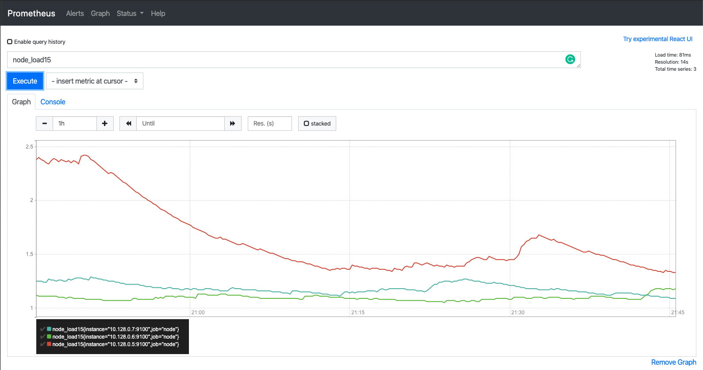

# Table of contents

* **[Preparation](#preparation)**
* **[First steps](#first-steps)**
* **[Namespaces](#namespaces)**
  * **[Your own namespace](#important-create-your-own-namespace)**
* **[Persisting Data](#persisting-data)**

# Preparation

1. Visit the GCP Console using an **incognito window** by going to
https://console.cloud.google.com/kubernetes/list?folder=&organizationId=&project=wizeline-academy-k8s-36bd66a7
2. Log in using the *Google Account* that you provided on the Wizeline
Academy registration form.
3. Click on the *Connect* button that appears besides the
`gke-academy-1` cluster.
4. Next hit the *Run in Cloud Shell* button to get the command that
connects to the K8s Cluster.
5. Hit enter on the `gcloud` command to execute it.
6. Send the *Cloud Shell* to a new window by hitting the button with
the little arrow.
7. Open the *Cloud Shell Editor* by clicking on the little pencil icon,
we'll use the editor to create the YAML files.

# First steps

## Inspecting the Cluster

```bash
kubectl get componentstatuses

kubectl get nodes
```

# Namespaces

## IMPORTANT: Create your own namespace.

The format suggested to use for the namespace name is
`firstName-lastName`, i.e juan-perez.

```bash
# Create your own namespace
kubectl create namespace <firstName-lastName>

# IMPORTANT: Set the namespace in the current context
kubectl config set-context --current --namespace=<firstName-lastName>
```

## Namespaces explained

```bash
# List the namespaces
kubectl get namespaces
```

The students will see all the namespaces from the other participants.
The resources each participant create will be created
inside their own namespace, collisions will not happen
no matter if their resources are named the same.

One common example about how namespaces are used in real
world scenarios is to separate application environments, like
`development` and `production`.

# Persisting Data

## Create the Pod manifest file

Google Cloud Shell Editor can be used to easily create the file.

```yaml
# Using the Google Cloud Shell Editor
# Create the file nginx-pod.yaml
apiVersion: v1
kind: Pod
metadata:
  name: nginx-pod
spec:
  containers:
  - name: nginx
    image: nginx:latest
```

```bash
# Create the pod using the manifest file
kubectl create -f nginx-pod.yaml

# List pods
kubectl get pods

# See the pod's detailed information
kubectl describe pod nginx-pod

# Delete the pod
kubectl delete pod nginx-pod
```

# Daemonset

## First we create the Daemonset manifest file

```yaml
# node-exporter.yaml
apiVersion: apps/v1
kind: DaemonSet
metadata:
  name: node-exporter
  labels:
    app: node-exporter
spec:
  selector:
    matchLabels:
      app: node-exporter
  template:
    metadata:
      labels:
        app: node-exporter
        name: node-exporter
      annotations:
         prometheus.io/scrape: "true"
         prometheus.io/port: "9100"
    spec: 
      hostPID: true
      hostIPC: true
      hostNetwork: true
      containers:
        - ports:
            - containerPort: 9100
              protocol: TCP
          resources:
            requests:
              cpu: 0.15
          securityContext:
            privileged: true
          image: prom/node-exporter:v1.0.1
          args:
            - --path.procfs
            - /host/proc
            - --path.sysfs
            - /host/sys
            - --collector.filesystem.ignored-mount-points
            - '"^/(sys|proc|dev|host|etc)($|/)"'
          name: node-exporter
          volumeMounts:
            - name: dev
              mountPath: /host/dev
            - name: proc
              mountPath: /host/proc
            - name: sys
              mountPath: /host/sys
            - name: rootfs
              mountPath: /rootfs
      volumes:
        - name: proc
          hostPath:
            path: /proc
        - name: dev
          hostPath:
            path: /dev
        - name: sys
          hostPath:
            path: /sys
        - name: rootfs
          hostPath:
            path: /
---
kind: Service
apiVersion: v1
metadata:
  annotations:
    prometheus.io/scrape: 'true'
  labels:
    name: node-exporter
  name: node-exporter
spec:
  clusterIP: None
  ports:
  - name: scrape
    port: 9100
    targetPort: 9100
    protocol: TCP
  selector:
    app: node-exporter
```
```bash
# Create the daemonset
kubectl apply -f node-exporter.yaml
```
## The prometheus server requires a config file to know what are the resources that is going to monitor
```yaml
global:
  scrape_interval:     15s 

# A scrape configuration containing exactly one endpoint to scrape:
# Here it's Prometheus itself.
scrape_configs:
  
  - job_name: 'node'

    # Override the global default and scrape targets from this job every 5 seconds.
    scrape_interval: 5s

    dns_sd_configs:
      - names:
        - node-exporter.<firstname-lastName.svc.cluster.local
        type: A
        port: 9100
```

## The way we pass this config file to the prometheus pod is through a configMap 
```bash
# Creating Configmap from file
kubectl create configmap prometheus-example-cm --from-file=prometheus.yml
```

## Then we create a deployment for the prometheus server which will collect and display the metrics of each node and the service that will expose the server
```yaml
apiVersion: apps/v1
kind: Deployment
metadata:
  name: prometheus-deployment
  labels:
    app: prometheus
    purpose: example
spec:
  replicas: 1
  selector:
    matchLabels:
      app: prometheus
      purpose: example
  template:
    metadata:
      labels:
        app: prometheus
        purpose: example
    spec:
      containers:
      - name: prometheus-example
        image: prom/prometheus
        volumeMounts:
          - name: config-volume
            mountPath: /etc/prometheus/prometheus.yml
            subPath: prometheus.yml
        ports:
        - containerPort: 9090
      volumes:
        - name: config-volume
          configMap:
           name: prometheus-example-cm # Here we use the configmap previously defined and it will be mount inside the container
---
kind: Service
apiVersion: v1
metadata:
  name: prometheus-example-service
spec:
  selector:
    app: prometheus
    purpose: example
  ports:
  - name: promui
    protocol: TCP
    port: 9090

  type: NodePort
```

## Now we must get the address and port where our server is listening

```bash

export NODE_IP=$(kubectl get nodes -o jsonpath="{.items[0].status.addresses[1].address}")
export NODE_PORT=$(kubectl get  -o jsonpath="{.spec.ports[0].nodePort}" services prometheus-example-service)
# this command will print the address we must put in our browser
echo http://$NODE_IP:$NODE_PORT

```
## if you enter to that url you should see somethin like this if you run the query node_load15
### this shows how there is a pod on each node monitoring its performance



# Health Checks
.
.
.
.
.
.

# Clean up

Type `exit` on your *Cloud Shell* session.

Close your incognito browser window.
